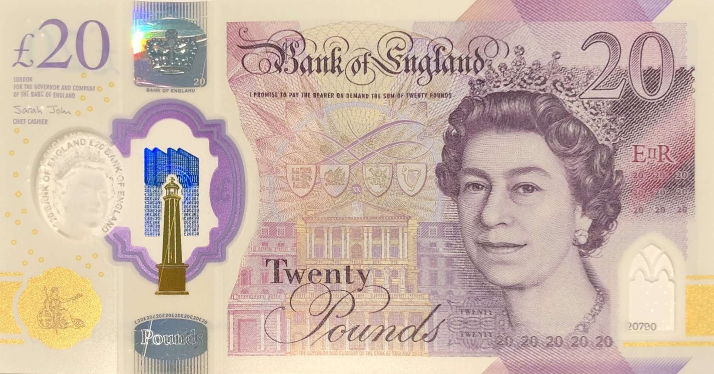

# 作業一  Homework1

## 三維電腦視覺與深度學習應用

**3D Computer Vision with Deep Learning Applications**

---

R11921038 江讀晉

## Problem 1. Homography Estimation

### **Conduct the python file**

```bash
$ python 1.py ./images/1-0.png ./images/1-1.png ./groundtruth_correspondences/correspondence_01.npy

OR

$ python 1.py ./images/1-0.png ./images/1-2.png ./groundtruth_correspondences/correspondence_02.npy
```

### **Sample k correspondences**

- 實作方法：
    - 使用原本撰寫完成的SIFT以及ratio test，找到多個對應點。
    - 給定指定之k值（k＝4、8、20、50），每次從對應點中隨機挑選k個index，實作約數千次homography和projection之計算，並從中挑選出映射坐標和ground truth之MSE（mean square error）最小的組合，將其作為sampled correspondences並以opencv繪制並展示對應pair。
    
- 1-1.png → 1-2.png 實作結果：
    - k = 4
        
        ![The k-th pairs used in homography estimation: [450, 1058, 1171, 1377]](report/match4.png)
        
        The k-th pairs used in homography estimation: [450, 1058, 1171, 1377]
        
    
    ---
    
    - k = 8
        
        ![The k-th pairs used in homography estimation: [84, 365, 402, 539, 835, 1094, 1155, 1220]](report/match8.png)
        
        The k-th pairs used in homography estimation: [84, 365, 402, 539, 835, 1094, 1155, 1220]
        
        ---
        
    - k = 20
        
        ![The k-th pairs used in homography estimation: [30, 40, 109, 134, 294, 368, 464, 465, 475, 491, 519, 652, 725, 747, 760, 1139, 1158, 1292, 1299, 1317]](report/match20.png)
        
        The k-th pairs used in homography estimation: [30, 40, 109, 134, 294, 368, 464, 465, 475, 491, 519, 652, 725, 747, 760, 1139, 1158, 1292, 1299, 1317]
        
        ---
        
    - k = 50
        
        ![The k-th pairs used in homography estimation: [3, 17, 33, 98, 108, 109, 139, 160, 172, 179, 221, 283, 298, 329, 338, 350, 366, 375, 396, 424, 459, 527, 554, 581, 646, 659, 692, 695, 717, 733, 797, 852, 876, 884, 914, 917, 988, 1033, 1076, 1149, 1177, 1220, 1232, 1243, 1274, 1314, 1318, 1385, 1428, 1439]](report/match50.png)
        
        The k-th pairs used in homography estimation: [3, 17, 33, 98, 108, 109, 139, 160, 172, 179, 221, 283, 298, 329, 338, 350, 366, 375, 396, 424, 459, 527, 554, 581, 646, 659, 692, 695, 717, 733, 797, 852, 876, 884, 914, 917, 988, 1033, 1076, 1149, 1177, 1220, 1232, 1243, 1274, 1314, 1318, 1385, 1428, 1439]
        

- 1-1.png → 1.3.png 實作結果
    - k = 4
        
        ![The k-th pairs used in homography estimation: [0, 19, 20, 71]](report/match4%201.png)
        
        The k-th pairs used in homography estimation: [0, 19, 20, 71]
        
        ---
        
    - k = 8
        
        ![The k-th pairs used in homography estimation: [16, 20, 39, 42, 48, 49, 68, 78]](report/match8%201.png)
        
        The k-th pairs used in homography estimation: [16, 20, 39, 42, 48, 49, 68, 78]
        
        ---
        
    - k = 20
        
        ![The k-th pairs used in homography estimation: [2, 7, 8, 12, 13, 15, 16, 26, 33, 40, 46, 49, 51, 53, 56, 61, 65, 68, 82, 84]](report/match20%201.png)
        
        The k-th pairs used in homography estimation: [2, 7, 8, 12, 13, 15, 16, 26, 33, 40, 46, 49, 51, 53, 56, 61, 65, 68, 82, 84]
        
        ---
        
    - k = 50
        
        ![The k-th pairs used in homography estimation: [0, 1, 2, 3, 6, 7, 8, 9, 10, 12, 13, 16, 17, 19, 27, 28, 31, 33, 34, 35, 36, 37, 38, 40, 41, 45, 46, 47, 49, 53, 55, 56, 58, 59, 60, 61, 63, 64, 66, 67, 69, 71, 79, 80, 81, 82, 83, 84, 85, 86]](report/match50%201.png)
        
        The k-th pairs used in homography estimation: [0, 1, 2, 3, 6, 7, 8, 9, 10, 12, 13, 16, 17, 19, 27, 28, 31, 33, 34, 35, 36, 37, 38, 40, 41, 45, 46, 47, 49, 53, 55, 56, 58, 59, 60, 61, 63, 64, 66, 67, 69, 71, 79, 80, 81, 82, 83, 84, 85, 86]
        

### **Compare the errors**

- 實作方法：
    - 同上方描述，每次從對應點中隨機挑選k個index，實作約數千次homography和projection之計算，並從中挑選出映射坐標和ground truth之MSE最小的組合。

- 1-1.png → 1-2.png 誤差（單次測試）：
    
    
    |  | Errors, k = 4 | Errors, k = 8 | Errors, k = 20 | Errors, k = 50 |
    | --- | --- | --- | --- | --- |
    | DLT | 0.016630 | 0.007885 | 0.015161 | 0.005375 |
    | Normalized DLT | 0.016630 | 0.008479 | 0.009455 | 0.005322 |
    - 1-1.png → 1-2.png的取樣點較多，且較少出現極端值，因此在挑選出適當pairs後，使用DLT（direct linear transform）或Normalized DLT所計算出的結果不會相差甚遠。
    - 隨著k值增加，所計算出homography越穩定，其error值也較小。

- 1-1.png → 1-3.png 誤差（單次測試）：
    
    
    |  | Errors, k = 4 | Errors, k = 8 | Errors, k = 20 | Errors, k = 50 |
    | --- | --- | --- | --- | --- |
    | DLT | 0.081723 | 0.100752 | 0.145025 | 396.705687 |
    | Normalized DLT | 0.081723 | 0.089145 | 0.099293 | 1.951471 |
    - 1-1.png → 1-3.png的取樣點經ratio test後，僅留下約88點，因此當k越大時，極端值不易排除。
    - 由上表可以發現，當k = 50時，其用DLT的表現並不理想。然而，使用Normalized DLT，其表現則進步甚多。

### **Discussion**

- 未能保證找到global optima：
    
            因在brute force幾千次（epochs）的測試中找出最佳解時，每次都會使用到random，因此無法保證每次都會找到相同的解。當然，為求穩定，也是可以採用固定seed之作法，或者測試數回（total times of compiling and running）再取平均。
    
- Homography estimation表現受取樣點影響顯著：
    
            即使每次使用相同作法求出homography，在同樣的題目下，projection和ground truth間的mse差距可以達一至兩個數量級。因此如何找取樣點確實為重要課題。
    

## Problem 2. Document Rectification

### Input document image


2-0.jpg

- 拍攝者：    江讀晉
- 拍攝時間：Wednesday | Aug 24, 2022 | 3:04 PM
- 拍攝地點：The British Museum
- 拍攝器材：Apple iPhone 8

### Conduct the python file

- 目標：將20元英鎊校正為矩形正面。
- 環境：
    - Python >= 3.6
- Package：
    - cv2 (OpenCV) >= 4.5.1.48
    - numpy >= 1.19.5
    - sys
    - math

1. 輸入指令。
    
    ```bash
    $ python 2.py <image_file_name>
    
    預設為
    $ python 2.py ./images/2-0.jpg
    ```
    

1. 程式執行後，會有視窗跳出，需手動點擊視窗標記鈔票角落座標。終端機會顯示如下：
    
    ```bash
    Please mark four corners of the currency.
    Order: 1.left-top 2.right-top 3.left-bottom 4.right-bottom.
    ```
    

1. 需沿著圖片「左上」、「右上」、「左下」、「右下」的順序。標記完後如下圖所示：
    
    
    
    2-1.jpg
    

1. 將四個點標齊後，點擊畫面不會新增座標點也不會有反應。此時按下鍵盤任意鍵即可關閉視窗。以下為終端機顯示範例：
    
    ```bash
    Mark the point: (h, w) = (475, 596)
    Mark the point: (h, w) = (493, 1674)
    Mark the point: (h, w) = (990, 473)
    Mark the point: (h, w) = (1048, 1767)
    End of marking! Press any key to colse the window.
    ```
    
2. 程式執行結束，終端機會提示可以至`./images`查看結果。
    
    ```bash
    Check the result: ./images/2-2.jpg.
    ```
    
    
    
    2-2.jpg
    

### Method implementation

- Corner坐標尋找
    
            關於坐標的標記，我參考了助教給的範例，最終使用滑鼠或游標手動標記的方式。不過為了避免無意義的點擊過多點，我修改部分程式碼，當標記完四點後，點擊畫面不會有坐標點的紀錄，亦無紅色圓圈回饋，僅能按下任意鍵結束視窗。
    
            原本有嘗試過撰寫程式碼，將前後景分離（比如大津二值化算法，Otsu thresholding）再去除鈔票後方白色明信片背景，最後計算出剩餘前景的坐標點何處為頂點。然而實際執行後，由於部分背景intensity和前景其實相差不遠，因此分離效果不是很理想，並造成求出的頂點坐標不太可用，遂放棄此一作法。
    
- Warping
    
            我撰寫的方式為backward warping，因為我認為由新的坐標點推導回原本影像的四個存在的坐標，此方式較為直觀，且可以大概檢查出坐標位置在原圖中何處，較方便除錯。
    
            而進行插值時，因本題應該皆為從圖片小部分放大到影響貼齊邊緣，因此使用backward warping時，index不會超出可用的坐標點，計算上較為方便。
    
- 校正後的影像尺寸
    
            為了保持鈔票比例的正確性，因此我將新生成的影像尺寸比例固定，算出放大至長邊尺寸的所放比例後再將其等比例放大，以求出和原圖解析度相近的影像。
